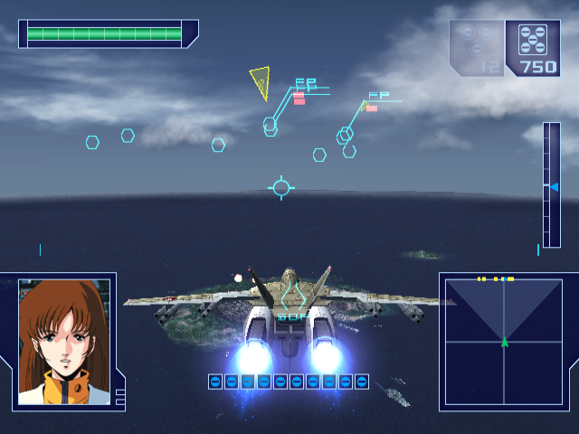
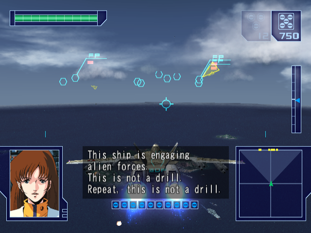
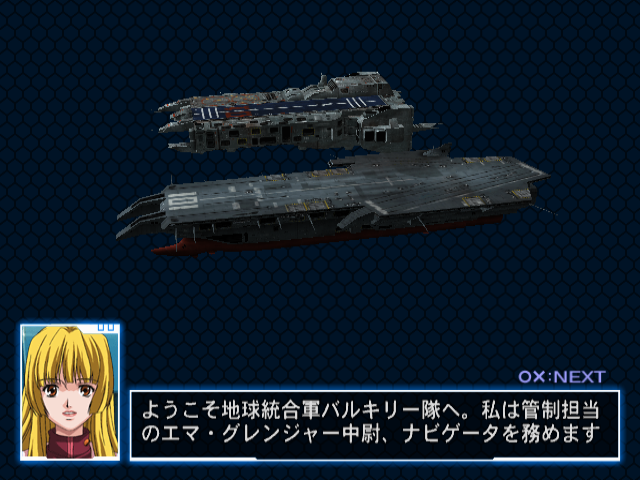
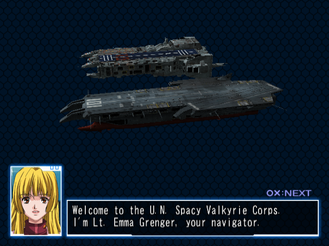
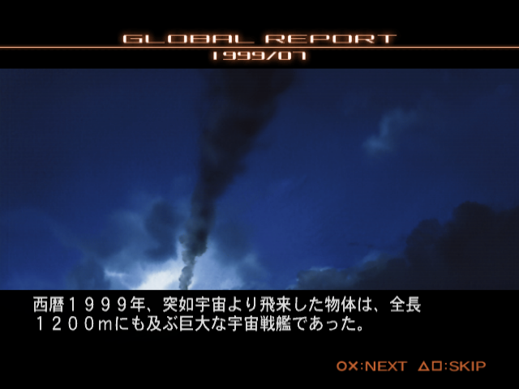
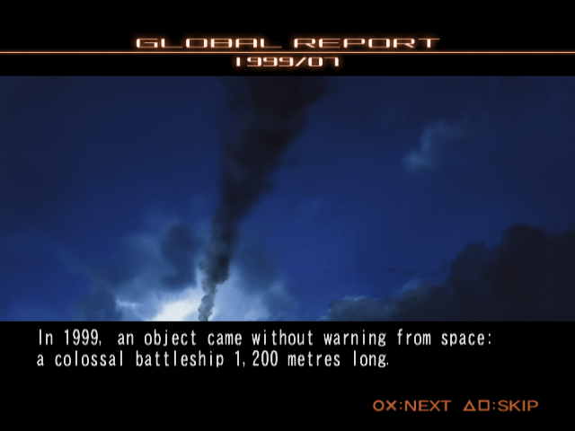

# Macross: English translation tooling

Tooling for an English fan translation of **Chou Jikuu Yousai Macross**
(超時空要塞マクロス, PS2, SLPM-65405, Sega AM2 / Bandai, 2003).

> **Disclaimer:** This repo was developed by a coding AI agent (Claude
> Opus/Sonnet 5). **This repository contains no game data and no game script.** It ships tools and
documentation for creating a translation patch for the game with minimal technical knowledge. You supply your own copy of the game; everything Japanese is extracted on your machine and never
committed.

## What works

- Every string in the game's text file is found, edited and written back —
  **2,777 strings, 2,739 of them Japanese, 64,092 characters**.
- The game's own font already has Latin glyphs, so **no font hack is needed**.
- English fits in place: **2.12 ASCII characters per Japanese character**, so
  nothing has to be moved and no pointers need rewriting.
- Proven by a full-coverage stress build — all 2,739 Japanese strings
  replaced with traceable placeholders, booted, and checked on screen.
- Line breaks are yours to place: the game wraps on character count, so an
  explicit newline is how you stop it splitting a word.
- **Spoken radio dialogue can be subtitled** with `--subtitles` — 1,811 lines
  the game says out loud but never shows.
- **No size ceiling.** `BOOTDAT.CMP` only gets 97 sectors on the disc and
  `JPN.CVM` is packed solid, which is not enough — translating the short,
  repetitive lines first actually makes the compressed file *grow*. When that
  happens `tools/build.py` rebuilds the container with room to spare, so you
  never have to shorten a sentence to make a build fit.

### Subtitles for the spoken radio dialogue

During missions the pilots talk over the radio, and the game speaks those
lines without showing them. It turns out the engine already has the whole
caption system — text, window and timing — and simply marks most in-mission
lines as voice only. `tools/build.py --subtitles` turns them on.

| Without `--subtitles` | With `--subtitles` |
|---|---|
|  |  |

It is a **one-byte edit per line**, not a code patch, and the timing is the
game's own: the caption is held for exactly the length of the voice clip,
measured by `SND_GetVoicePlayTime`. **1,811 lines** are affected.

### Before / after

Same scene, same input, unmodified disc on the left and a build from this
tooling on the right. (The *dialogue* in these frames was translated to
demonstrate the pipeline and is not part of the shipped translation — see
below.)

| Before | After |
|---|---|
|  |  |
|  |  |

## Requirements

- Python 3.8+ (standard library only; `tkinter` for the editor)
- Your own copy of the game as an ISO — the supported image is verified by
  checksum before anything is written
- A PS2 emulator to play the result. Development used
  [ARMSX2](https://github.com/ARMSX2/ARMSX2), the native arm64 macOS build;
  official PCSX2 works too.

## Setup

The CRICMP codec is a third-party tool and is not committed here. Build it
once and drop the binary in `tools/`:

```sh
git clone https://github.com/zeesworth/cricmp
cd cricmp && make
cp cricmp ../macross-en/tools/cricmp
```

## Use

```sh
python3 tools/verify.py "Macross (Japan).iso"          # is this the right image?
python3 tools/make_workbook.py "Macross (Japan).iso"   # -> work/workbook.csv
python3 tools/editor.py                                # translate (or use a spreadsheet)
python3 tools/build.py "Macross (Japan).iso" "Macross (EN).iso"
python3 tools/build.py "Macross (Japan).iso" "Macross (EN).iso" --subtitles
```

`make_workbook.py` extracts the Japanese from *your* disc and seeds the
English column from `translation/english.json`, so existing work shows up
next to what is still to do. `work/` is gitignored — **do not commit the
workbook**, it contains the publisher's script.

`build.py` refuses to touch the source image, checks every line against its
byte budget before writing anything, and reads the finished ISO back to
confirm each string really arrived.

## What is translated here

`translation/english.json` carries **290 strings** — enough to navigate and
play the game in English:

- **All the menus**: stage and track names, pause and confirmation menus,
  difficulty labels, save/load prompts, controller warnings. (Several menus
  were already English on the disc.)
- **233 HUD and radio strings**: damage and status callouts, enemy contact
  and bearings, clock positions, directions, mission orders, squadron names,
  and the tutorial's button prompts.

**The story script is deliberately not translated here.** That is a human
translator's job, and this repository exists to make that job possible, not
to do it badly. **2,449 lines are waiting in the workbook.**

## Known limitations

- **The game wraps text on character count, not word boundaries**, so a long
  line can break mid-word. Keep lines short or place explicit newlines.
- **Radio captions get four lines of 28 characters.** The window is that size
  whether or not you fill it, so a two-line caption leaves a visible gap.
  Write to fill it.
- Subtitles are only lightly playtested — the tutorial mission. Enabling all
  1,811 lines is the blunt setting; some may be silent by design, and the
  caption window clips the lower HUD slightly.
- **Stage title cards, the logo and 2D menu art are textures** (`SBTTL_*`,
  `MENU2D`, `TTL`, `LOGO` — TIM2 format), not text. Translating them is an
  art job this tooling does not cover.
- Memory-card save titles (`str-027a9c-017`..`023`) are deliberately left
  alone; renaming them would orphan existing save data. They are already
  readable English words, just in full-width characters.
- Only SLPM-65405 (Japan) is supported.
  Another release needs its own hashes in `tools/verify.py`.

## Documentation

- [`docs/FORMATS.md`](docs/FORMATS.md) — disc layout, containers, text
  formats, emulator control, and the traps
- [`docs/TASK_SPEC.md`](docs/TASK_SPEC.md) — the constraints this work is held to
- [`docs/JOURNAL.md`](docs/JOURNAL.md) — how it went, including the dead ends
- [`stress/README.md`](stress/README.md) — the full-coverage harness

## Credits

CRICMP compression is handled by [`zeesworth/cricmp`](https://github.com/zeesworth/cricmp),
which names this game in its README and supplies both a decompressor and a
recompressor.
